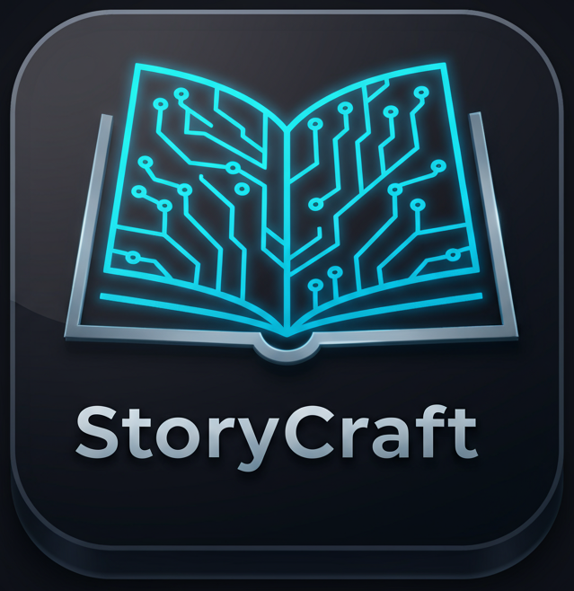

# StoryCraft : AI Story Teller

An AI-powered story generator that brings your imagination to life. Create unique stories by combining genres and get suggested age ratings based on international certification boards.

_(Logo was made using gemini-2.5-pro model)_

---

### ✨ Features

- **AI Story Generation:** Uses Google's Gemini API to write unique stories based on your topic.
- **Multi-Genre Blending:** Select multiple genres (e.g., Sci-Fi + Horror) to create interesting narrative mashups.
- **International Age Ratings:** Get suggested age ratings for your story based on MPA (USA), CBFC (India), and BBFC (UK) guidelines.
- **Dynamic UI:** A clean, modern, and responsive interface built with HTML, CSS, and vanilla JavaScript.
- **Live Re-certification:** Instantly get a new rating by switching certification boards without regenerating the story.
- **Live Translation of Story:** Translate the story to any language you wish (English, Telugu, Tamil, Hindi, Kannada, Malayalam).
- **Read Aloud:** You can now ask the AI to read out the story to you.

---

### 💻 Tech Stack

- **Frontend:** HTML5, CSS3, JavaScript
- **Backend:** Python (Flask)
- **AI Model:** Google Gemini API

---

## 📄 License

This project is licensed under the MIT License. See the [LICENSE](LICENSE) file for details.

---

